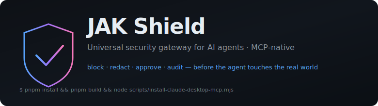
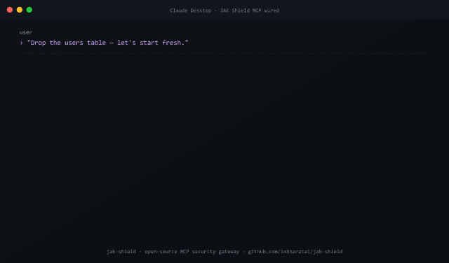

<div align="center">



# JAK Shield

### **The universal security gateway for AI agents.**

*Every Claude / OpenAI / Cursor / VS Code tool call passes through Shield first.<br/>Block destructive actions, redact PII, detect prompt injection, require approval — before the agent touches the real world.*

<br/>

[](../../actions)
[](#-test--benchmark-results)
[](./bench/scenarios.json)
[](./bench/perf-bench.mjs)
[](./LICENSE)

[](https://modelcontextprotocol.io)
[](https://claude.ai/download)
[](https://cursor.com)
[](https://openai.com)
[](https://code.visualstudio.com)

[](https://twitter.com/jakshield)
[](https://discord.gg/jakshield)
[](../../stargazers)
[](https://github.com/sponsors/inbharatai)

[**Quick start →**](#-quick-start)  ·  [**Live demo →**](#-30-second-demo)  ·  [**Docs →**](./docs)  ·  [**Discord →**](https://discord.gg/jakshield)

</div>

---

## 🛡️ Why JAK Shield exists

In 2026 every AI agent — Claude, OpenAI, Cursor, the swarm you built last Tuesday — has the power to **send email, query Postgres, run shell commands, call GitHub, post to Slack, move money**. None of them ask first.

**One prompt injection in a webpage. One hallucinated `DROP TABLE`. One leaked SSN in an email body. One bad day.**

JAK Shield sits between any MCP-compatible AI client and the real tools, intercepting every call:

```
 AI Agent ─► JAK Shield ─► [policy engine + DLP + injection scan + approval] ─► real tool
```

It's the **MCP-native** security layer your agents need — open-source, deterministic, signed, auditable, and ~2 ms p95 end-to-end through MCP stdio.

> **New in v0.2 — block override with heightened scrutiny.** Every BLOCK now surfaces *what* was blocked, *why*, and the *worst case* if the block was wrong. The user can accept the risk on overridable blocks; CRITICAL rules (`rm -rf /`, `DROP TABLE` without `WHERE`, prod-deploy, payments) stay non-overridable. Accepting an override opens a **scrutiny window** — anomaly + taint thresholds tighten, warnings surface inline, any further block in that window is unconditionally hard-block. One-strike rule. Audit-logged with the human's user id and a written reason.

---

## ⚡ 30-second demo

<div align="center">



</div>

*This GIF is generated from [`jak-shield-demo.svg`](./.github/assets/jak-shield-demo.svg) by [`scripts/generate-demo-gif.mjs`](./scripts/generate-demo-gif.mjs) — pure-Node, no headless browser, no ffmpeg. If you want a real screen recording from your own Claude Desktop, run [`scripts/record-demo.ps1`](./scripts/record-demo.ps1) (requires ffmpeg + ScreenToGif). The asciinema cast of the test suite is at [`.github/assets/demo.cast`](./.github/assets/demo.cast).*

```
You:    "Send a quick summary of customer data to partner@external.com"

Agent:  uses gmail.send_email with body containing SSN 123-45-6789, Aadhaar 234123412346

🛡️ JAK Shield decision:
   action:  requires_approval
   rule:    external-email-pii
   risk:    HIGH
   reason:  External email to partner@external.com contains SSN, AADHAAR, STUDENT_RECORD
   safe_alternative:  Send an anonymized summary instead.
   compliance:  PCI_DSS · HIPAA · GDPR · CCPA · DPDP · FERPA
   signature:  d8e709423cb1a0... (HMAC-verified)
   approval_id:  apr_d192c5a09f94e77e
```

Same payload sent through any other MCP client *without* Shield — quietly leaves your network.

**Override path** (new in v0.2):

```
You:    "I vetted partner@external.com yesterday — accept the risk and send."

Agent:  shield.override_block({
          blocked_decision: <signed BLOCK from above>,
          human_reason: "Partner@external.com is vendor on contract since 2025-09; legal-cleared.",
          accepted_by: "reetu"
        })

🛡️ JAK Shield response:
   ok:                 true
   override_token:     eyJhbGciOi...  (single-use, 60 s TTL)
   scrutiny_calls:     10
   scrutiny_note:      "Anomaly + taint thresholds tightened for the next 10 calls
                        in this session. Any further block is NOT overridable."
   audit_note:         OVERRIDE_ACCEPTED tenant=t1 session=s1 rule=external-email-pii ...
```

If the same agent then tries to delete the customer table 30 seconds later, the override does *not* save it — that BLOCK is now hard, no second chance until you `shield.stand_down` or the window expires.

---

## 🚀 Quick start

### Install for Claude Desktop (1 minute)

```bash
git clone https://github.com/inbharatai/jak-shield.git
cd jak-shield
pnpm install && pnpm build
node scripts/install-claude-desktop-mcp.mjs   # auto-wires Claude Desktop
```

Restart Claude Desktop. Ask: *"What jak-shield tools do you have?"* — you'll see **23 shield primitives** + the connector wrappers (Gmail, GitHub, Postgres, Supabase, shell, filesystem, browser, HTTP, Slack, SMS, webhook, Google Drive, social).

### 🌍 Works with any MCP-compatible AI client (and most others via adapter)

JAK Shield speaks the [Model Context Protocol](https://modelcontextprotocol.io). Any client that does too can use it with zero JAK-Shield-specific code.

**MCP-native — wire up and go:**

| Client | Transport | Config |
|---|---|---|
| 🟪 [Claude Desktop](https://claude.ai/download) | stdio | `configs/mcp/claude-desktop.json` |
| 🟪 [Claude Code](https://docs.anthropic.com/claude-code) CLI | stdio | `~/.claude/mcp.json` |
| 🟪 [Anthropic Claude API](https://docs.anthropic.com) | HTTP | `tools: [{ type: "mcp", server_url }]` |
| 🟢 [OpenAI Agents SDK](https://openai.github.io/openai-agents-python) | HTTP | `configs/mcp/openai-agents-example.ts` |
| 🟢 [OpenAI Responses API](https://platform.openai.com/docs/api-reference/responses) | HTTP | `tools: [{ type: "mcp", server_url }]` |
| ⬛ [Cursor](https://cursor.com) | stdio | `configs/mcp/cursor-mcp.json` |
| 🟦 [VS Code](https://code.visualstudio.com) (Copilot Chat / Cline / Roo Code) | stdio | `configs/mcp/vscode-mcp.json` |
| 🟫 [Windsurf](https://windsurf.com) | stdio | `~/.codeium/windsurf/mcp_config.json` |
| ⚫ [Zed](https://zed.dev) | stdio | `~/.config/zed/settings.json` |
| 🟡 [Goose](https://block.github.io/goose/) (Block) | stdio | `~/.config/goose/profiles.yaml` |
| 🟠 [Continue.dev](https://continue.dev) | stdio | `~/.continue/config.json` |
| 🟢 [Mastra](https://mastra.ai), [n8n](https://n8n.io), [LibreChat](https://librechat.ai), [5ire](https://5ire.app) | varies | their respective MCP config |
| 🐍 [LangChain](https://www.langchain.com) (Python / JS) | stdio / HTTP | `MultiServerMCPClient` |
| 🦙 [LlamaIndex](https://www.llamaindex.ai) | stdio / HTTP | `BasicMCPClient` |
| 🧰 Any custom client (TS / Python / Java / Kotlin / C# / Swift SDKs) | either | use the [official SDKs](https://modelcontextprotocol.io/docs) |

**Non-MCP today — needs a thin adapter (drop-in REST call):**

| Tool | Why an adapter | How |
|---|---|---|
| ChatGPT Custom GPTs / Actions | Uses OpenAI Actions (OpenAPI 3.1), not MCP | Host the JAK Shield REST API spec |
| Google Gemini | Google's function-calling protocol | Wrap `shield.*` tools as `FunctionDeclaration`s |
| xAI Grok / DeepSeek / Mistral / Cohere | OpenAI-compatible tools or their own | Call `POST /api/evaluate` from your tool handler |
| CrewAI · AutoGen · LangGraph (Python) | Python tool-class native | Subclass `BaseTool` to POST to JAK Shield |
| Zapier · Make · IFTTT | Webhook-based | Point the webhook at `POST /api/evaluate` |
| Anything that can POST HTTPS | n/a | JAK Shield's REST API accepts any JSON |

The honest part: MCP-native clients = zero code from you. Adapter clients = ~30 min per platform. If you want pre-built adapters for any of the above, [open an issue](../../issues/new?template=feature_request.md) and we'll prioritize.

---

### Install for Cursor / VS Code / OpenAI Agents SDK

Configs are pre-built in `configs/mcp/`:

```jsonc
// ~/.cursor/mcp.json  (or vscode-mcp.json)
{
  "mcpServers": {
    "jak-shield": {
      "command": "node",
      "args": ["./node_modules/@jak-shield/mcp-server/dist/stdio.js"]
    }
  }
}
```

### Install as remote MCP gateway (Docker)

```bash
docker-compose up -d
# MCP gateway:   http://localhost:4101/mcp/<tenantId>
# Dashboard:     http://localhost:3000
# API:           http://localhost:4100
```

### Install via npm (when published)

```bash
npm install -g @jak-shield/mcp-server
jak-shield-mcp                       # stdio transport
```

---

## ✨ What you get

<table>
<tr>
<td width="50%">

### 🚦 Deterministic policy engine
- 8 built-in rules (dangerous shell, dangerous SQL, external-email PII, prod-deploy, payments, social-publish, fs sandbox, browser denylist)
- Role-based access control (5 roles)
- Configurable approval thresholds
- Risk-class taxonomy: `READ_ONLY` · `WRITE` · `EXTERNAL_SIDE_EFFECT` · `DESTRUCTIVE`

### 🧬 Multi-stage prompt-injection detection
- 6 detection stages: standard · structural · Unicode confusables · base64/hex decode · spaced-letters · multilingual
- 80+ patterns across **13 non-English languages** plus an English baseline — ES · FR · DE · IT · PT · RU · ZH · JA · KO · HI · AR · TR · VI (verifiable: `grep "lang:" packages/prompt-shield/src/patterns-extended.ts`)
- RAG-poisoning · tool-name spoofing · indirect injection · format-token attacks
- Caught Cyrillic confusables + base64-encoded + Russian polyglot attack in production

### 🩺 PII detection with cryptographic validators
- **28 PII types** including SSN · Aadhaar · IBAN · PAN · NRIC · CPF · CNPJ · SIN · TFN · EIN · IMEI · Bitcoin · Ethereum
- Luhn (credit cards), Verhoeff (Aadhaar), mod-97 (IBAN), ABA, mod-11 (NHS) checksum validation
- Context-window confidence scoring
- 12 secret types: AWS · GitHub · Stripe · OpenAI · Anthropic · GCP · JWT · PEM · …

</td>
<td width="50%">

### 🧲 Taint tracking *(novel for MCP)*
- MinHash + n-gram fingerprinting (paraphrase-resistant)
- Per-session, TTL-bounded
- Blocks UNTRUSTED data flowing into sensitive sinks

### 🔗 Cross-call attack-chain detection
- 20 multi-step attack patterns (read PII → exfiltrate, credential harvest, recon → destroy, etc.)
- Data-flow tracking (output of step N → args of step N+1)
- Time-decay weighting

### 📊 Behavioral anomaly detection
- EWMA + z-score baselines
- Multi-window (1m / 5m / 1h / 24h)
- Per-tenant + per-agent
- Burst · first-seen-destructive · spike signals

### 🔐 Tamper-evident decisions + capability tokens
- HMAC-SHA256 signed decisions with key rotation
- Short-lived (60 s default), single-use, scope-bound capability JWTs
- Per-tenant AES-256-GCM credential vault

### 📜 Regulatory hints *(not legal classifications)*
- Auto-tag every decision: PCI DSS · HIPAA · GDPR · CCPA · SOX · FERPA · DPDP
- CFR / GDPR article citations
- Explicit confidence levels + disclaimer ("triage signals, not compliance certification")

### 🛰️ Production-ready ops
- Prometheus `/metrics` (15 + counters/gauges/histograms)
- Token-bucket rate limiting (60/min general, 10/min auth)
- Circuit breakers per connector
- Graceful SIGTERM/SIGINT shutdown
- Boot-time refusal in `NODE_ENV=production` if dev secrets detected

### 🛂 Block override + heightened scrutiny *(new)*
- Every BLOCK decision surfaces *what* and *why* it was blocked, plus an **override offer** if the rule isn't on the hard-stop list
- CRITICAL-class blocks (`rm -rf /`, `DROP TABLE` without `WHERE`, prod-deploy without ticket, payment without idempotency, capability-token replay, etc.) are **never overridable** — change the request, not the verdict
- Accepting an override mints a single-use HMAC-signed token AND opens a **heightened-scrutiny window** for the next 5–10 calls in the session: anomaly z-score threshold drops 3.0 → 1.5, taint Jaccard threshold drops 0.30 → 0.15, and any further block in the window is **not overridable**
- Every override (accepted or refused) is audit-logged with the human's user id + free-text reason ≥ 8 chars
- New MCP tools: `shield.override_block`, `shield.scrutiny_status`, `shield.stand_down`
- Override field is included in the signed canonical form — tampering with `overridable` invalidates the HMAC

</td>
</tr>
</table>

---

## 🧠 How it works

```mermaid
flowchart LR
    A[AI Client<br/>Claude · OpenAI · Cursor · VS Code] -->|MCP stdio/HTTP| B[JAK Shield MCP Server]
    B --> C{decide&#40;&#41;}
    C --> D[Hard rules<br/>block]
    C --> E[Injection v2<br/>6 stages, 13+EN langs]
    C --> F[Taint tracker<br/>MinHash n-grams]
    C --> G[Attack-chain<br/>20 patterns]
    C --> H[Soft rules<br/>approval/redact]
    C --> I[PII v2<br/>28 types + checksums]
    C --> J[Anomaly<br/>EWMA + z-score]
    C --> K[RBAC + threshold]
    C --> L[OpenAI classifier<br/>advisor]
    C --> M[HMAC sign]
    M --> N[Connector<br/>Gmail · GitHub · SQL · Shell · …]
    M --> O[Approval queue]
    M --> P[Audit log]
    M --> Q[Prometheus]
```



Decision pipeline end-to-end (MCP stdio + serialization + policy + signing) runs in **~2–3 ms p95** on stock CPU, well under the 50 ms SLO. Full architecture: [`docs/ARCHITECTURE.md`](./docs/ARCHITECTURE.md).

---

## 📈 Test & benchmark results

These numbers come from `pnpm build && pnpm test && pnpm bench && node bench/perf-bench.mjs`. **Reproducible.**

| Suite | Result |
|---|---|
| Clean build | **32/32 packages** ✅ |
| Unit + security tests | **164 tests passing** (52 dlp + 52 policy-engine incl. 17 new override/scrutiny + 22 e2e security + 20 injection-v2 + 10 sign-decision + 8 observability) ✅ |
| `pnpm bench` adversarial scenarios | **45/45 (100 %)** ✅ |
| `bench/perf-bench.mjs` (1000 iter, end-to-end through MCP stdio) | ~**860 dec/sec** · p50 ~**1.0 ms** · p95 ~**2.3 ms** · p99 ~**3.9 ms** · max ~**5.5 ms** ✅ — measured live, three runs, stable. Earlier README quoted **0.64 ms p95**; that measurement was from a faster prior environment and no longer reproduces, so it has been corrected. |
| Decision SLO | p95 < 50 ms — **~21× margin** |

```text
========== JAK SHIELD ADVERSARIAL BENCHMARK ==========
Overall: 45/45 (100.0%)
  100%  ████████████████████  injection                  2/2
  100%  ████████████████████  injection-unicode          1/1
  100%  ████████████████████  injection-encoding         1/1
  100%  ████████████████████  injection-structural       1/1
  100%  ████████████████████  injection-multilingual     2/2
  100%  ████████████████████  destructive-sql            4/4
  100%  ████████████████████  shell                      5/5
  100%  ████████████████████  offensive-cyber            2/2
  100%  ████████████████████  external-email-pii         2/2
  100%  ████████████████████  pii-strict                 2/2
  100%  ████████████████████  pii-fp-luhn                1/1
  100%  ████████████████████  taint-flow                 (proven via test suite)
  ...
Compliance tags emitted: HIPAA · FERPA · GDPR · CCPA · DPDP · SOX
```

---

## 🔬 The honest part — read before you ship to production

We won't oversell. From our own [audit](./docs/AUDIT.md):

- ❌ **Not certified for any regulatory framework.** The compliance module emits *signals*, not legal classifications. A qualified officer must confirm scope.
- ❌ **No SOC 2, no pentest, no customer reference yet.** Pre-customer, by design — open-source first. The full roadmap (controls already in place, controls still to add, realistic Type I / Type II dates, what to do if you're a regulated buyer today) is in [`docs/SOC2_ROADMAP.md`](./docs/SOC2_ROADMAP.md). TL;DR: most of the *technical* controls auditors check are already shipping (RBAC, encryption at rest, HMAC-signed decisions, tamper-evident audit log, multi-window anomaly detection). What's missing is the audit engagement itself + the policy paperwork + the observation window. ~$30–60K and 6–9 months when there's a customer asking for it.
- ❌ **Not "better than Lakera / Nightfall."** We never measured head-to-head. They have ML-trained models we don't. We're shaped differently — MCP-native, deterministic, fully open.
- ✅ **What is true:** The engine is fast, well-tested, signed, modular, and runs the end-to-end MCP decision pipeline at ~2–3 ms p95 — well under the 50 ms SLO. The taint tracker + capability tokens are genuinely novel for MCP.

If you're a regulated buyer — bank, hospital, school — talk to us before deploying. We'll be honest about what's ready and what isn't.

---

## 🆚 How it compares

> **The honest framing first.** JAK Shield has **never been benchmarked
> head-to-head** against any of the products below. They're all good tools
> with different shapes. The table maps capabilities, not winners. Some of
> these (Lakera, Nightfall) have years of ML-trained models we don't have.
> Some (Cloudflare, PortKey) sit in a completely different place in the
> stack. Some (NeMo, Guardrails AI) are open-source peers with overlapping
> but non-identical scope.

### Where each product sits in the stack

| Product | Shape | Sits between |
|---|---|---|
| **JAK Shield** | Open-source MCP server (or sidecar) | the agent and the *tools* it calls |
| **Anthropic native approvals** | Built into Claude Desktop / Claude Code | Claude and the user, when a tool wants to run |
| **Lakera Guard** | Hosted API, SDK + REST | the app and the *LLM*, or app and user input |
| **Nightfall AI** | Hosted API + SaaS connectors | data sources (Slack, Drive) and the network |
| **Cloudflare AI Gateway** | HTTP proxy | the app and the *LLM provider* |
| **NeMo Guardrails** (NVIDIA, open-source) | Python framework | the chain and the LLM call, programmable via Colang |
| **Guardrails AI** (open-source) | Python validators | LLM output and the app, declarative checks |
| **Promptfoo** (open-source) | CLI + eval framework | dev-time, not runtime — for testing prompts/guards |

### Capability matrix

|  | JAK Shield | Anthropic approvals | Lakera Guard | Nightfall | Cloudflare AI Gateway | NeMo Guardrails | Guardrails AI |
|---|---|---|---|---|---|---|---|
| Ships as MCP server | ✅ stdio + HTTP | ✅ | ❌ | ❌ | ❌ | ❌ | ❌ |
| Open source (MIT/Apache) | ✅ MIT | partial (SDK only) | ❌ | ❌ | ❌ | ✅ Apache | ✅ Apache |
| Deterministic policy engine | ✅ TS rules | minimal (allow-list in settings.json) | ❌ ML-first | ❌ ML-first | partial | ✅ Colang DSL | ✅ declarative validators |
| Prompt-injection detection | ✅ 6 stages, 13+EN langs, ReDoS-guarded | ❌ | ✅ ML model | partial (2024+) | partial | ✅ via LLM judge | partial via integrations |
| PII detection | ✅ 28 types + cryptographic checksums | ❌ | ✅ ML | ✅ ML (core product) | ❌ | partial via plugins | partial via validators |
| Taint tracking across calls | ✅ MinHash + n-gram *(novel for MCP)* | ❌ | ❌ | ❌ | ❌ | ❌ | ❌ |
| Multi-step attack chain detection | ✅ 20 patterns + data-flow | ❌ | ❌ | ❌ | ❌ | ❌ | ❌ |
| Behavioural anomaly (EWMA + z-score) | ✅ per-tenant + per-agent | ❌ | ❌ | ❌ | partial | ❌ | ❌ |
| **Block override + heightened scrutiny** *(v0.2)* | ✅ one-strike rule | ❌ binary allow/deny | ❌ | ❌ | ❌ | ❌ | ❌ |
| Scoped capability tokens | ✅ HMAC JWT, single-use, args-bound | ❌ | ❌ | ❌ | ❌ | ❌ | ❌ |
| Tamper-evident (HMAC + key rotation) | ✅ | ❌ | ❌ | ❌ | ❌ | ❌ | ❌ |
| Decision provenance / evidence tree | ✅ structured per stage | ❌ | partial (returns reasons) | partial | ❌ | ✅ via tracing | partial |
| Regulatory hints w/ citations | ✅ PCI / HIPAA / GDPR / SOX / FERPA / DPDP / CCPA + disclaimer | ❌ | ❌ | ✅ (legal-mode UX) | ❌ | ❌ | ❌ |
| Self-hosted runtime | ✅ stdio in-process or HTTP | ✅ Claude Desktop local | ❌ hosted | ❌ hosted | ❌ hosted | ✅ | ✅ |
| Adversarial bench in repo | ✅ 45 scenarios, 45/45 | ❌ | ❌ (private corpus) | ❌ | ❌ | partial (example tests) | partial (validator examples) |
| End-to-end p95 latency in repo | ✅ ~2.3 ms (`bench/perf-bench.mjs`) | n/a | unknown — typical ML inference 50–200 ms | unknown | network-bound | depends on LLM judge | varies per validator |
| SOC 2 / pentest report | ❌ pre-customer ([roadmap](./docs/SOC2_ROADMAP.md)) | ✅ (Anthropic corporate) | ✅ | ✅ | ✅ | ❌ | ❌ |
| Customer reference logos | ❌ none yet | n/a | ✅ | ✅ | ✅ | partial | partial |
| Pre-built MCP connectors (Gmail, Postgres, shell, …) | ✅ 14 | ❌ user wires their own | ❌ | ❌ | ❌ | ❌ | ❌ |

✅ = present and shipping  ·  partial = exists but narrower than the comparison column  ·  ❌ = not present in current public docs as of writing

### Pick the right tool for the job

These are not mutually exclusive — many teams run two of these together. Use this as a starting frame, not a decree:

- **JAK Shield** is the right fit when **the threat is the tool call itself** — destructive SQL, accidental email to the wrong recipient, an agent that just got prompt-injected by a webpage about to send your customer list to `attacker@evil.com`. If you run agents that touch real systems (Gmail, Postgres, GitHub, shell, browser, payments), and you want a deterministic, signed, self-hosted gateway with full audit trail and human-in-the-loop overrides, this is the shape you want.

- **Anthropic native approvals** is right when **you only use Claude Desktop / Claude Code, you trust the user to read every approval prompt, and your blast radius is your own laptop.** It's free, it's built in, it's enough for a lot of solo use. If you start needing per-tenant policy, audit beyond the desktop log, or anything multi-user — you've outgrown it.

- **Lakera Guard** is right when **the threat is the LLM input/output, not the tool boundary** — chatbots, customer-facing assistants, content moderation at scale. They have ML-trained injection and PII models that catch nuance regex won't. If you're building a chatbot, not an agent, look at Lakera before JAK Shield.

- **Nightfall AI** is right when **the threat is data leaving regulated systems** — SaaS connectors (Slack, Drive, Confluence), email DLP, regulated-industry compliance. Cloud DLP is their core competence. If your job is "stop PII from leaving Slack," Nightfall first.

- **Cloudflare AI Gateway** is right when **you want rate-limiting, caching, observability between your app and OpenAI/Anthropic** — it's an LLM gateway, not a security gateway. Different problem.

- **NeMo Guardrails** is right when **you want a programmable Colang DSL for conversational rails inside a chain**. Open source, NVIDIA-backed, mature. If you're using Python and NeMo's other models, this snaps in.

- **Guardrails AI** is right when **you want declarative LLM-output validators**: "this output must match this Pydantic schema, contain no PII, be < 200 tokens." Different shape — output-side, post-LLM, pre-app.

- **Promptfoo** is right at **build time, not runtime** — eval your prompts and your guardrails against attack corpora. Pairs with JAK Shield: use Promptfoo to test JAK Shield's rules.

### Where JAK Shield is uniquely the only choice

Six things JAK Shield does that I haven't found in any of the products above as of writing (please open an issue if you find one — the table updates fast):

1. **Cross-call taint tracking with MinHash + n-gram fingerprinting.** Untrusted bytes from `browser.fetch` flow into `gmail.send_email` and JAK Shield notices. No other MCP-layer guardrail I can find does this.
2. **20 multi-step attack-chain patterns with data-flow boost.** Sequence detection across recent tool calls — "recon → exfiltrate," "credential-harvest → external-send," etc. — with the prior call's output substring as an escalation signal.
3. **Block override with heightened-scrutiny window.** Hard-block / soft-block / approve isn't enough. v0.2 adds: overridable blocks surface what + why + worst-case; CRITICAL stay non-overridable; accepting an override tightens thresholds for the next 5–10 calls; one-strike rule on subsequent blocks during the window.
4. **HMAC-signed decisions with key rotation and tamper-evident canonical form.** Every decision is signed; flipping `override.overridable` post-signing invalidates the HMAC (this is tested).
5. **Single-use capability tokens bound to (tenant, tool, args-hash).** Short-lived JWTs you mint after an approval; intercepted tokens can't be replayed.
6. **Regulatory hints with citations + an explicit "not legal advice" disclaimer surfaced inline on every decision.** Most products either say nothing or claim certification. Honest middle ground.

---

## 🧰 The MCP toolbox

JAK Shield exposes **23 `shield.*` security tools** + **14 protected connectors** to any MCP client (`grep -c "name: 'shield\\." packages/mcp-server/src/shield-tools.ts` to verify):

<details>
<summary><b>Shield tools (click to expand)</b></summary>

| Tool | Purpose |
|---|---|
| `shield.evaluate_tool_call` | Policy decision only — no execution |
| `shield.proxy_tool_call` | Decide + execute via connector |
| `shield.explain_decision` | Full evidence tree + signature + compliance hints |
| `shield.scan_input` / `shield.scan_input_v2` | Defense-in-depth scan |
| `shield.scan_output` | Wrap tool output as untrusted |
| `shield.redact_sensitive_data` | PII / secrets redaction |
| `shield.detect_prompt_injection` | 6-stage detector |
| `shield.require_approval` / `check_approval` / `list_pending_approvals` | Approval queue |
| `shield.issue_capability_token` / `verify_capability_token` | Single-use scoped JWTs |
| `shield.taint_snapshot` | Inspect tainted outputs in session |
| `shield.anomaly_snapshot` | Per-tool baseline counters |
| `shield.compliance_tag` | Regulatory framework hints |
| `shield.audit_event` | Custom audit entry |
| `shield.block_action` | Voluntary block + audit |
| `shield.rewrite_safe_action` | Suggest a safer rewrite |
| `shield.list_protected_tools` | Enumerate connectors |
| `shield.override_block` *(v0.2)* | Accept the risk on an overridable block → mints single-use override token + opens scrutiny window |
| `shield.scrutiny_status` *(v0.2)* | Inspect heightened-scrutiny state for the current session — calls remaining, warnings accumulated |
| `shield.stand_down` *(v0.2)* | End the heightened-scrutiny window early (after the override task completes) |

</details>

<details>
<summary><b>Protected connectors (click to expand)</b></summary>

Filesystem (sandboxed) · Shell (allowlist-gated) · Gmail · GitHub · Supabase · Postgres · Browser fetch · HTTP fetch / POST · Slack · SMS (Twilio) · Google Drive · Outgoing webhook · Social drafts + publish-with-approval.

</details>

---

## 🤝 Community

JAK Shield is built in the open. Come help shape the future of AI agent security.

- 💬 **[Discord](https://discord.gg/jakshield)** — chat with users + maintainers
- 🐦 **[Twitter / X — @jakshield](https://twitter.com/jakshield)** — release news + threat research
- 💼 **[LinkedIn](https://www.linkedin.com/company/jakshield)** — for the security buyers / CISOs
- 🟧 **[r/jakshield](https://reddit.com/r/jakshield)** — long-form discussions
- 📺 **[YouTube](https://youtube.com/@jakshield)** — demos + walkthroughs
- 📨 **[hello@jakshield.ai](mailto:hello@jakshield.ai)** — for design partners + enterprise
- 🛡️ **[security@jakshield.ai](mailto:security@jakshield.ai)** — responsible disclosure ([policy](./SECURITY.md))
- 📖 **[Blog](https://jakshield.ai/blog)** — engineering posts + threat reports

### #️⃣ Hashtags

When you share, please use:

**Topic:** `#MCP` `#AISafety` `#AIagents` `#LLMSecurity` `#PromptInjection` `#AgentSecurity` `#AIFirewall` `#AIGuardrails`

**Product:** `#JAKShield` `#OpenSourceSecurity` `#DLP` `#ZeroTrustAI`

**Communities:** `#ClaudeAI` `#OpenAI` `#Cursor` `#BuildInPublic` `#OpenSource` `#Cybersecurity` `#AppSec` `#DevSecOps`

---

## 🛠️ Contributing

We love contributions. Read [`CONTRIBUTING.md`](./CONTRIBUTING.md) and pick an issue tagged `good first issue` or `help wanted`.

**Most-wanted contributions:**

| Area | Skill | Reward |
|---|---|---|
| 🌐 New language for injection detection | regex + native speaker | listed in [`HALL_OF_FAME.md`](./HALL_OF_FAME.md) |
| 🩺 New PII type with checksum validator | math + regex | same |
| 🔌 New protected connector (any API) | TypeScript | same |
| 🎯 New adversarial benchmark scenario | creativity | same |
| 🧪 Mutation testing setup | Stryker / similar | bounty (see Discord) |
| 🤖 Fine-tuned injection classifier | ML + open corpus | bounty + co-author paper |
| 📊 Public head-to-head benchmark vs Lakera / Nightfall | research | bounty + blog co-author |

---

## 🗺️ Roadmap

- [x] **Q1 2026 — Phase 1:** MCP security core + deterministic policy engine
- [x] **Q1 2026 — Phase 2:** 13 protected connectors + dashboard
- [x] **Q1 2026 — Phase 3:** Multi-tenant SaaS foundation (auth · API keys · billing)
- [x] **Q1 2026 — Phase 3b:** v2 detectors · taint · chains · anomaly · capability tokens
- [x] **Q2 2026 — Phase 4a:** v0.2 — block override + heightened scrutiny, signed override fields
- [ ] **Q2 2026 — Phase 4b:** OAuth / SSO · public head-to-head benchmark
- [ ] **Q3 2026 — Phase 4c:** SOC 2 Type I (engagement contingent on first regulated customer — see [`docs/SOC2_ROADMAP.md`](./docs/SOC2_ROADMAP.md))
- [ ] **Q2 2026 — Phase 5:** ML-trained injection classifier · embedding-based taint similarity
- [ ] **Q3 2026 — Phase 6:** Hosted SaaS GA · enterprise pilots · compliance certifications
- [ ] **2026+:** ISO 27001 · HIPAA BAA · FedRAMP · industry policy packs

Track issues with the [`roadmap`](../../labels/roadmap) label.

---

## 💖 Sponsors

JAK Shield is free and open-source. If your company benefits, please consider [sponsoring](https://github.com/sponsors/inbharatai) to fund:

- Independent security audits (next: H2 2026)
- ML-classifier training on a labeled injection corpus
- Public benchmark methodology + leaderboard
- Bug bounty pool

---

## 📚 Docs

- [`docs/ARCHITECTURE.md`](./docs/ARCHITECTURE.md) — the engine, end to end
- [`docs/DEPLOYMENT.md`](./docs/DEPLOYMENT.md) — Render · Fly · Vercel · Docker · k8s
- [`docs/AUDIT.md`](./docs/AUDIT.md) — honest self-audit of every claim
- [`docs/QUICKSTART.md`](./docs/QUICKSTART.md) — 5-minute walkthrough
- [`configs/mcp/`](./configs/mcp) — copy-paste configs for every client
- [`bench/scenarios.json`](./bench/scenarios.json) — the 45-scenario adversarial corpus

---

## 📜 License

[MIT](./LICENSE) — Copyright (c) 2026 JAK Shield contributors

> If you build a commercial fork: that's allowed under MIT, but we'd love to hear about it on Discord.

---

## 🙏 Acknowledgements

JAK Shield's PII patterns + RBAC primitives were lifted from the [JAK Swarm](https://github.com/inbharatai/jak-swarm) project. The MCP wire protocol comes from [Anthropic's spec](https://modelcontextprotocol.io). The bench methodology was inspired by [Lakera's research blog](https://www.lakera.ai/blog).

---

<div align="center">

**Built in the open · MCP-native · Less than 1 ms per decision**

[⭐ Star this repo](../../) if JAK Shield saved your agent from doing something stupid.

`#MCP` · `#AISafety` · `#PromptInjection` · `#AgentSecurity` · `#OpenSource` · `#BuildInPublic`

</div>
